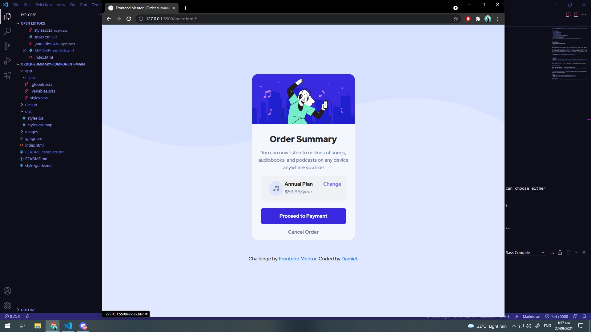
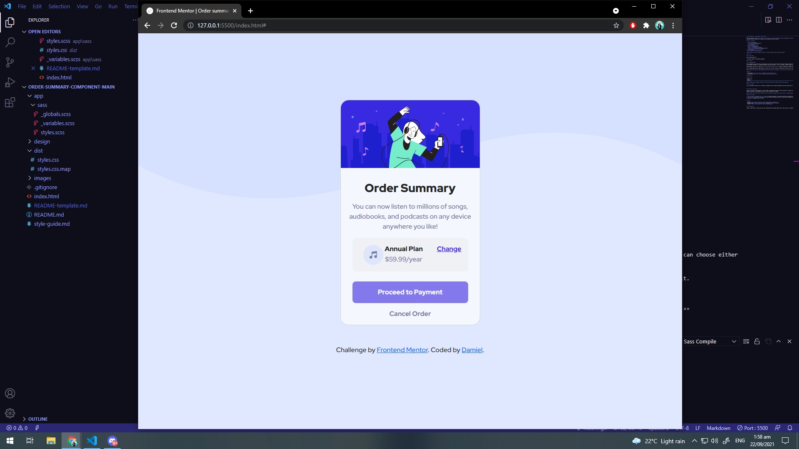
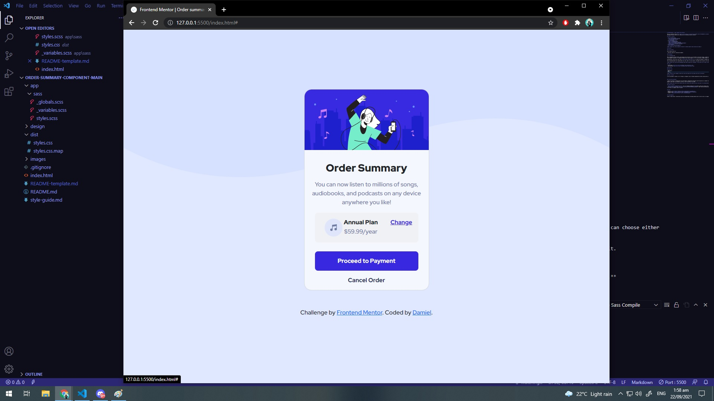

# Frontend Mentor - Order summary card solution

This is a solution to the [Order summary card challenge on Frontend Mentor](https://www.frontendmentor.io/challenges/order-summary-component-QlPmajDUj). Frontend Mentor challenges help you improve your coding skills by building realistic projects. 

## Table of contents

- [Overview](#overview)
  - [The challenge](#the-challenge)
  - [Screenshot](#screenshot)
  - [Links](#links)
- [My process](#my-process)
  - [Built with](#built-with)
  - [What I learned](#what-i-learned)
  - [Continued development](#continued-development)
  - [Useful resources](#useful-resources)
- [Author](#author)
- [Acknowledgments](#acknowledgments)

**Note: Delete this note and update the table of contents based on what sections you keep.**

## Overview

### The challenge

Users should be able to:

- See hover states for interactive elements

### Screenshot

### Links

- Solution URL: [Add solution URL here](https://your-solution-url.com)
- Live Site URL: [Add live site URL here](https://your-live-site-url.com)

## My process

### Built with

- Bootstrap 5
- Sass
- Flexbox

**Note: These are just examples. Delete this note and replace the list above with your own choices**

### What I learned

In this challenge I learned a lot of things as a beginner such as Flexbox manipulation and Sass nesting and its fun and rewarding to complete the challenge.

### Continued development

I need to be faster at thinking how to do the Flexbox  manipulation efficiently and the position css element also needs to familiarize it better and lastly my sass manipulation because i dont know if my nesting is correct or not let me know if its good. 

**Note: Delete this note and the content within this section and replace with your own plans for continued development.**

### Useful resources

- [Bootstrap](https://getbootstrap.com/) - This css framework helped me to do flexbox system and customize the card component
- [Youtuber-Coder Coder](https://www.youtube.com/channel/UCzNf0liwUzMN6_pixbQlMhQ) - She's the one ive been watching to learn frontend development and because of her i know how to use sass as a beginner level of course.

## Author

- Website - [Damiel](https://damiel31.github.io/damielmaquiling.githhub.io/)
- Frontend Mentor - [@Damiel31](https://www.frontendmentor.io/profile/Damiel31)
- Twitter - [@Damianeqtpie](hhttps://twitter.com/Damianeqtpie)

## Acknowledgments

Thanks to Coder Coder I learned Sass and this Frontend Mentor Challenge website and it test my skill as a beginner. And of course google.

